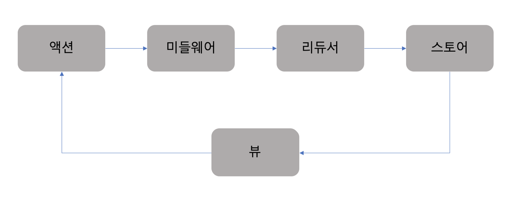

# 6장 리덕스로 상태 관리하기

## 리덕스

 * 리덕스(redux)는 자바스크립트를 위한 상태 관리 프레임워크이다. 
 * 많은 리액트 프로젝트에서 리덕스를 함께 사용하는데, 다양한 장점이 있기 때문이다.
    - 컴포넌트 코드로부터 상태 관리 코드를 분리할 수 있다.
    - 서버 렌더링 시 데이터 전달이 간편하다.
    - 로컬 스토리지에 데이터를 저장하고 불러오는 코드를 쉽게 작성할 수 있다.
    - 같은 상탯값을 다수의 컴포넌트에서 필요로 할 때 좋다. 
    - 부모 컴포넌트에서 깊은 곳에 있는 자식 컴포넌트에 상탯값을 전달할 때 좋다.
    - 알림창과 같은 전역 컴포넌트의 상탯값을 관리할 때 좋다.
    - 페이지가 전환되어도 데이터는 살아 있어야 할 때 좋다.

<br><br><br>

## 리덕스 사용 시 따라야 할 세 가지 원칙

 * 전체 상탯값을 하나의 객체에 저장한다.
    - 장점
        - 전체 상탯값이 하나의 자바스크립티 객체로 표현되기 때문에 활용도가 높아진다.
        - 하나의 객체를 직렬화(serialize)해서 서버와 클라이언트가 프로그램의 전체 상탯값을 서로 주고받을 수 있다.
        - 특정한 상태에 있을 때 발생하는 버그를 잡기위해 그 상탯값을 저장한 후 반복해서 재현할 수 있다.
        - 최근의 상탯값을 버리지 않고 저장해 놓으면 실행 취소(undo) 와 다시 실행(redo) 기능을 쉽게 구현가능.
    - 단점
        - 프로그램의 전체 상탯값을 리덕스로 관리하는 것이 쉬운것이 아니다. 
        - 애니메이션을 위한 데이터나 문자열 입력창의 현재 상탯값은 컴포넌트에서 관리하는 것이 더 나을수도 있다.
    
    - 프로그램의 일부 상태만 리덕스를 이용해 관리해도 된다.
    - 특별히 로직이 복잡하지 않은 페이지에서는 컴포넌트의 상탯값을 활용하는 것이 생산성을 더 높일 수도 있다.

 * 상탯값은 불변 객체다.
    - 상탯값은 오직 액션 객체에 의해서만 변경 되어야 한다. 

        ```javascript
        // 액션 객체는 type 속성값이 존재해야 한다.
        // type 속성값으로 액션 객체를 구분한다. 
        // type 속성값을 제외한 나머지는 상탯값을 수정하기 위해 사용하는 정보이다. 
        const incrementAction = {
            type: 'INCREMENT',
            amount : 123,
        };

        const conditionalInrementAction = {
            type : 'CONDITIONAL_INCREMENT',
            amount: 2,
            gt: 10,
            lt: 100,
        };

        // 액션 객체와 함께 dispatch 메서드를 호출하면 상탯값이 변경된다. 
        store.dispatch(incrementAction);
        store.dispatch(conditionalInrementAction);
        ```
        - 리덕스의 상탯값을 수정하는 유일한 방법은 액션 객체와 함께 dispatch 메서드를 호출하는 것이다. 다른방법으로 수정하면 안 된다.

    - 상탯값 수정만 놓고보면 불변 객체를 사용하는 것보다 직접 수정하는 것이 빠르다.
    - 하지만 이전 상탯값과 이후 상탯값을 비교해서 변경 여부를 파악할 때는 불변 객체가 훨씬 유리하다. 

 * 상탯값은 순수 함수에 의해서만 변경되어야 한다. 
    - 리덕스에서 상탯값을 변경하는 함수를 리듀서(reducer)라고 부른다. 
    - 리듀서의 구조 : ```(state, action) => nextState```
    - 리듀서는 이전 상탯값과 액션 객체를 입력으로 받아 새로운 상탯값을 만드는 순수 함수이다.
        - 순수 함수에서는 부수 효과를 발생시키지 않아야한다.<br>(부수효과 :  전역 변수의 값을 수정한다거나 API 요청을 보내는 등 함수 외부의 상태를 변경시키는 것)
        - 순수 함수는 같은 인수에 대해 항상 같은 값을 반환해야 한다.
        - 함수 안에서 계산하는 과정에서 랜덤 함수나 시간 함수를 이용하면 순수 함수가 아니다. 

<br><br><br>        

## 리덕스의 주요 개념 이해하기
 * 리덕스에서 상탯값이 변경되는 과정은 다음 그림과 같다.

    
    - 여기서 뷰는 리액트의 컴포넌트라고 생각할 수 있다.

 * 액션
    - 액션은 type 속성값을 가진 자바스크립트 객체이다. 
    - 액션 객체를 dispatch 매서드에 넣어서 호출하면 리덕스는 상탯값을 변경하기 위해 위의 그림과 같은 과정을 수행한다.

    - 액션을 발생시키는 코드

        ```javascript
        store.dispatch({type: 'todo/ADD', title: '영화 보기', priority: 'high'});
        store.dispatch({type: 'todo/REMOVE', id: 123});
        store.dispatch({type: 'todo/REMOVE_ALL'});
        ```
        - type 속성값을 ADD 라고 지정한 경우 중복될 가능성이 높다. type 이름의 충돌을 피하기위해 위와같이 접두사를 붙여 사용한다.
    
    - 위와 같이 dispatch 메서드를 호출할 때 직접 액션 객체를 입력하는 방법은 지양하는 것이 좋다.
    - 다음과 같이 액션 생성자 함수를 이용해 해결하도록 하자.

        ```javascript
        // 액션 생성자 함수 정의
        // 액션 생성자 함수를 필요한 인수와 함께 호출하면 항상 같은 구조의 액션 객체가 만들어진다. 
        // 이후 액션 객체의 구조를 변경하고싶다면 액션 생성자 함수만 수정하면 된다.
        function addTodo({ title, priority }) {
            return { type: 'todo/ADD', title, priority };
        }
        function removeTodo({ id }) {
            return { type: 'todo/REMOVE', id };
        }
        function removeAllTodo() {
            return { type: 'todo/REMOVE_ALL' };
        }

        // dispatch 메서드를 호출할 때는 액션 생성자 함수를 이용한다. 
        store.dispatch(addTodo({ title: '영화 보기', priority: 'high' }));
        store.dispatch(removeTodo({ id: 123 }));
        store.dispatch(removeAllTOdo());
        ```

    - type 속성값은 리듀서에서 액션 객체를 구분할 떄도 사용되기 때문에 상수 변수로 만드는 것이 좋다.

        ```javascript
        // type 이름을 상수 변수로 만들었다
        // 이 변수는 리듀서에서도 필요하기 때문에 export 키워드를 이용해 외부에 노출한다.
        export const ADD = 'todo/ADD';
        export const REMOVE = 'todo/REMOVE';
        export const REMOVE_ALL = 'todo/REMOVE_ALL';

        // 액션 생성자 함수도 외부에서 호출해야 하므로 외부로 노출한다.
        export function addTodo({ title, priority }) {
            return { type: ADD, title, priority };
        }
        export function removeTodo({ id }) {
            return { type: REMOVE, id };
        }
        export function removeAllTodo() {
            return { type: REMOVE_ALL };
        }
        ```
    - 액션 생성자 함수는 리덕스의 세 가지 원칙에 어긋나지 않으므로 부수 효과를 발생시켜도 된다.

 * 미들웨어
    - 미들웨어(middleware)는 리듀서가 액션을 처리하기 전에 실행되는 함수이다.
    - 디버깅 목적으로 상탯값 변경 시 로그를 출력하거나, 리듀서에서 발생한 예외를 서버로 전송하는 등의 목적으로 미들웨어를 활용할 수 있다.
    - 리덕스 사용 시 특별히 미들웨어를 설정하지 않았다면 발생한 액션은 곧바로 리듀서로 보내진다

    - 미들웨어의 기본 구조 : <br>```const myMiddleware = store => next => action => next(action);```

    - 미들웨어는 직접 만들어서 사용하기 보다는 라이브러리를 가져다 쓴다.
    - 자주 사용하는 라이브러리로는  redux-thunk, redux-saga, redux-observable, redux-promise-middleware 등이 있다.

 * 리듀서
    - 리듀서(reducer)는 액션이 발생했을 때 새로운 상탯값을 만드는 함수다.
    - 리듀서의 기본 구조 : <br>```(state, action) => nextState```

    - 리듀서 함수 작성의 예

        ```javascript
        // 리덕스는 스토어를 생성할 때 상탯값이 없는 리듀서를 호출한다.
        // 따라서 매개변수의 기본값을 사용해서 초기 상탯값을 정의해 준다.
        function reducer(state = INITIAL_STATE, action) {
            switch (action.type) {
                //...
                
                // 각 액션 타입별로 case 문을 만들어서 처리한다
                case REMOVE_ALL:
                    return {
                        // 상탯값은 불변 객체로 관리해야 하므로 수정할 때마다 새로운 객체를 생성한다.
                        // 전개 연산자(...) 을 사용하면 상탯값을 불변 객체로 관리할 수 있다.
                        ...state,
                        todo: [],
                    };
                case REMOVE:
                    return {
                        ...state,
                        todo: state.todos.filter(todo => todo.id !== action.id),
                    };
                    // 처리할 액션이 없다면 상탯값을 변경하지 않는다.
                case ADD:
                    return {
                        ...state,
                        todo:[
                            ...state.todos,
                            {id = getNewId(),title: action.title, priority: action.priority},
                        ],
                    }
                default :
                    return state;
            }
        }

        const INITIAL_STATE = { todos: []};
        ```

        - 위 코드에서 ADD 를 작성하는데 전개연산자를 2번이나 사용했다. 추후 더 깊은 곳에 있는 값을 수정하려하면 코드의 가독성이 많이 떨어질 것이다. 
        - 이를 위해 자브스크립트에서 불변 객체를 관리할 목적으로 여러 패키지를 제공하고있다. 

    - 불변 객체를 관리하기 위한 패키지 중 하나인 이머(immer) 패키지에 대해 알아보자. 

        ```javascript
        import produce from 'immer';

        const person = { name: 'mike', age: 22};
        
        // produce 의 첫 번째 매개변수는 변경하고자  하는 객체를 나타낸다.
        // 두 번째 매개변수는 첫 번째 매개변수로 입력된 객체를 수정하는 코드이다.
        const newPerson = produce(person, draft => {
            // draft 매개변수는 person 객체라고 생각하고 코드를 작성하면 된다.
            // draft.age 를 수정해도 person 객체의 값을 변경되지 않는다. draft 객체를 수정하면 produce 함수가 새로운 객체를 반환한다. 
            draft.age = 32;
        });
        ```

        - 이전에 보았던 코드의 ADD를 이머를 사용해서 리팩토링 한 코드

            ```javascript
            function reducer(state = INITIAL_STATE, action) {
                // switch 문 전체를 produce 로 감싼다. 
                return produce(state, draft => {
                    switch (action.type) {
                        case ADD:
                            draft.todos.push(action.todo);
                            break;
                        case REMOVE_ALL:
                            draft.todos = [];
                            break;
                        case REMOVE:
                            draft.todos = draft.todos.filter(todo => todo.id !== action.id);
                            break;
                        default:
                            break;
                    }
                });
            }
            ```
    
    - 리듀스 작성 시 주의할 점
        - 데이터 참조
            - 리덕스의 상탯값은 불변 객체이기 때문에 언제든지 객체의 참조값이 변경될 수 있다. 
            - 따라서 객체를 참조할 때는 객체의 참조값이 아니라 고유한 ID 값을 이용하는 것이 좋다.
            - ID 값으로 참조하면 객체의 데이터가 변경되어도 별 문제없이 데이터를 가리킬 수 있다. 
        - 순수 함수
            - 리듀서는 순수함수로 작성해야한다. 
            - 랜덤 함수나, 시간함수를 이용해 상탯값을 만들면 안된다.(같은 인수로 호출해도 다른 값이 반환될 수 있기 떄문)
            - API 호출은 부수 효과이기 때문에 API를 호출하는 함수는 순수 함수가 아니다.(API 호출은 액션 생성자 함수나 미들웨어에서 하면 된다.)
    
    - createReducer 함수로 리듀서 작성하기
        - 위에서는 리듀서 함수를 작성할 때 switch 문을 사용했다. createReducer 함수를 이용하면 switch 문 보다 간결하게 리듀서 함수를 작성할 수 있다.

        - createReducer 함수의 예

            ```javascript
            // createReducer 함수의 첫 번째 인자로 초기 상탯값을 입력.
            // 두 번째 인자는 액션 처리 함수를 담고 있는 객체다.
            const reducer = createReducer(INITIAL_STATE, {
                [ADD] : (state, action) => state.todos.push(action.todo),
                [REMOVE_ALL] : state => (state.todos = []),
                [REMOVE] : (state, action) => state.todos.filter(todo => todo.id !== action.id),
            });
            ```
 * 스토어
    - 스토어(store)는 리덕스의 상탯값을 가지는 객체다. 
    - 스토어는 액션이 발생하면 미들웨어 함수를 실행하고, 리듀서를 실행해서 상탯값을 새로운 값으로 변경한다. 이후 사전에 등록된 모든 이벤트 처리 함수에게 액션의 처리가 끝났음을 알린다. 
    - 특별한 이유가 없다면 스토어는 하나만 만드는 것이 좋다. (전체 상탯값을 하나의 스토어에서 관리)
    - 스토어에 등록된 함수는 액션이 처리될 때마다 호출된다.

<br><br><br>

## 일단은 여기까지가 기본적인 내용인 것 같다. 추후 내용은 아직 이해가 잘 되지 않아 간단한 리액트 프로젝트를 통해 기본기를 익힌 후 다시 공부하도록 하자.